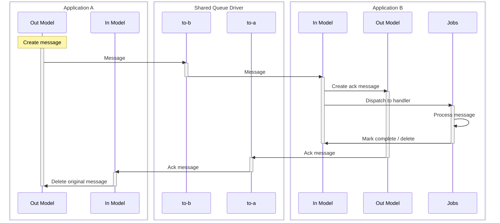

[](https://packagist.org/packages/consilience/laravel-message-flow) [](https://packagist.org/packages/consilience/laravel-message-flow) [](https://packagist.org/packages/consilience/laravel-message-flow) [](https://packagist.org/packages/consilience/laravel-message-flow)

# Laravel Message Flow

<!-- TOC -->

- [Laravel Message Flow](#laravel-message-flow)
    - [Overview](#overview)
    - [Concepts](#concepts)
        - [Messages](#messages)
        - [Outbound Flow](#outbound-flow)
        - [Inbound Flow](#inbound-flow)
        - [Routing Pipeline](#routing-pipeline)
        - [Message Statuses](#message-statuses)
    - [Configuration Overview](#configuration-overview)
- [Installation](#installation)
    - [Requirements](#requirements)
    - [Install Using Composer](#install-using-composer)
    - [Publish Migrations and Config](#publish-migrations-and-config)
- [Setting Up a Shared Queue (Redis Example)](#setting-up-a-shared-queue-redis-example)
    - [The Three Config Layers](#the-three-config-layers)
    - [Step 1 — Redis Server Entry](#step-1--redis-server-entry)
    - [Step 2 — Queue Entry](#step-2--queue-entry)
    - [Step 3 — Sender: Outbound Routing](#step-3--sender-outbound-routing)
    - [Step 4 — Receiver: Worker and Observer](#step-4--receiver-worker-and-observer)
    - [Two-Way Communication](#two-way-communication)
- [Artisan Commands](#artisan-commands)
    - [Create Message](#create-message)
    - [List Messages](#list-messages)
    - [Purge Messages](#purge-messages)
- [Testing](#testing)

<!-- /TOC -->

## Overview

Laravel Message Flow is a lightweight messaging system for passing structured
data between Laravel applications. It is built entirely on Laravel's queue
system — if two or more applications can connect to the same queue (Redis, database,
SQS, or any other driver), they can exchange messages.

There are no external dependencies beyond Laravel itself. No message broker
to install, no new protocols to learn — just queue connections you already
know how to configure.

The original use-case was to replace fragile webhooks between a suite of
applications with something easier to set up, monitor and maintain.


## Concepts

### Messages

A message is any JSON-serialisable data. Each message carries three things:

- A **UUID** that uniquely identifies the message across applications.
- A **name** used for routing (determines which queue to send to) and handling
  (which observer processes it on the receiving side).
- A **payload** — the JSON data itself, portable and self-contained with
  no dependency on models or classes in the source application.

### Outbound Flow

Sending a message is as simple as creating a `MessageFlowOut` model instance.
An Eloquent observer detects the new record and dispatches it through a
configurable **routing pipeline** that determines which queue connection and
queue name to use, then pushes the message onto that queue.

The outbound message is stored in the `message_flow_out` table throughout
this process, giving you a local audit trail of what was sent.

### Inbound Flow

On the receiving application, a standard Laravel queue worker picks up the
job and writes it to the local `message_flow_in` table as a `MessageFlowIn`
model. Your application then handles the message via an Eloquent observer —
the same pattern you already use for model events.

Once processed, the inbound message can be marked as `complete`, `failed`,
or just deleted, depending on your application's needs.

### Routing Pipeline

The outbound routing pipeline is a sequence of configurable pipe stages
(using Laravel's `Pipeline`) that each message passes through before being
dispatched. The default pipeline routes the message to a queue based on its
name (via config mappings), dispatches it, and optionally cleans up the
local record.

You have full control over this pipeline. You can add custom routing logic,
logging, duplicate detection, or anything else — each stage is a simple
class implementing a `handle` method.

### Message Statuses

Both inbound and outbound messages track their lifecycle through a `status`
column:

**Outbound (`MessageFlowOut`):**

| Status     | Meaning                                          |
|------------|--------------------------------------------------|
| `new`      | Created, waiting to be routed and dispatched     |
| `queued`   | Successfully dispatched to the queue             |
| `complete` | Fully processed (dispatched, optionally acknowledged) |
| `failed`   | Could not be dispatched — can be retried         |

**Inbound (`MessageFlowIn`):**

| Status     | Meaning                                          |
|------------|--------------------------------------------------|
| `new`      | Received, waiting for the application to handle  |
| `complete` | Successfully processed by the application        |
| `failed`   | Processing failed — can be retried               |

Failed messages are never automatically deleted, so they can be inspected
and retried. Completed messages can be cleaned up with the
`message-flow:purge` artisan command or by enabling the
`DeleteCompleteMessage` pipe in the outbound routing pipeline.

Optionally, acknowledgement messages can be sent in the reverse direction
to confirm end-to-end delivery:



## Configuration Overview

| Role | What to configure |
| --- | --- |
| **All apps** | Shared Redis entry + queue entry (Steps 1-2), identical on every app |
| **Sender** | Outbound routing in `message-flow.php` (Step 3) |
| **Receiver** | Queue worker + Eloquent observer (Step 4) |

For two-way communication, each app is both sender and receiver —
see [Two-Way Communication](#two-way-communication) below.

# Installation

## Requirements

- PHP `8.4` or higher
- Laravel `10`, `11` or `12`

## Install Using Composer

```bash
composer require consilience/laravel-message-flow
```

## Publish Migrations and Config

```
php artisan vendor:publish \
    --provider="Consilience\Laravel\MessageFlow\MessageFlowServiceProvider"
```

You can then run `php artisan migrate` to create the message flow inbound
and outbound tables.

# Setting Up a Shared Queue (Redis Example)

This example uses Redis, but any queue driver supported by Laravel
will work. The same four steps apply regardless of driver.

## The Three Config Layers

Laravel uses the word "connection" at several levels, which can be
confusing. Setting up a shared queue touches three config files, each
at a different layer:

| Layer            | Config file               | What it names                                                       |
| ---------------- | ------------------------- | ------------------------------------------------------------------- |
| **Redis server** | `config/database.php`     | How to reach a Redis server and which key prefix to use             |
| **Queue**        | `config/queue.php`        | A named queue that uses the shared Redis server entry as its driver |
| **Message Flow** | `config/message-flow.php` | Which connection and queue to push messages onto                    |

No changes to your existing Laravel defaults are needed — we just add
new entries alongside them.

## Step 1 — Redis Server Entry

`config/database.php`

Add a Redis entry with a **fixed prefix** so that every application
sharing the queue sees the same keys, regardless of each app's global
Redis prefix:

```php
'redis' => [
    // Your existing options and entries stay unchanged.

    // Shared Redis entry for message flow:
    'message-flow-redis' => [
        'url' => env('REDIS_URL'),
        'host' => env('REDIS_HOST', '127.0.0.1'),
        'password' => env('REDIS_PASSWORD', null),
        'port' => env('REDIS_PORT', '6379'),
        'database' => env('REDIS_DB', '0'),
        // This is the shared prefix that all the apps use.
        'prefix' => 'message-flow:',
    ],
],
```

## Step 2 — Queue Entry

`config/queue.php`

Add a queue entry that uses the Redis entry from Step 1 as its backend:

```php
'connections' => [
    // ...

    'message-flow-queue' => [
        'driver' => 'redis',
        // Redis entry from Step 1
        'connection' => 'message-flow-redis',
        // You can specify the input queue here to save having to specify
        // it later when the queue worker is run. Example: 'to-warehouse'
        'queue' => 'default',
        'retry_after' => 90,
        'block_for' => null,
    ],
],
```

> **Steps 1 and 2 are identical on every application** sharing the same
> message flow. They define the shared transport — not who sends or
> receives.

## Step 3 — Sender: Outbound Routing

`config/message-flow.php`

Tell Message Flow which queue name to push outbound messages onto.
**Name each queue after the receiver** — this keeps things unambiguous
regardless of how many senders push to it:

```php
'out' => [
    'name-mappings' => [
        'default' => [
            'queue-connection' => 'message-flow-queue', // ← queue entry from Step 2
            'queue-name' => 'to-warehouse',             // ← what the receiver listens on
        ],
    ],
],
```

In this example `to-warehouse` is the name of the queue that the warehouse app
will be listening to.

Different message names can route to different receivers. The warehouse and
billing may be different apps:

```php
'name-mappings' => [
    'stock-update' => [
        'queue-connection' => 'message-flow-queue',
        'queue-name' => 'to-warehouse',
    ],
    'invoice-ready' => [
        'queue-connection' => 'message-flow-queue',
        'queue-name' => 'to-billing',
    ],
],
```

Send a message by creating a `MessageFlowOut` record. `stock-update`
here will both route the payload to the correct recipient queue,
and can be used within the recipient application to send the message
on to the correct handler:

```php
use Consilience\Laravel\MessageFlow\Models\MessageFlowOut;

MessageFlowOut::create([
    'name' => 'stock-update',
    'payload' => ['sku' => 'ABC-123', 'qty' => 50],
]);
```

An Eloquent observer dispatches the message through the routing
pipeline automatically — no additional code needed on the sender side.

## Step 4 — Receiver: Worker and Observer

**Start a worker** listening on the queue name that senders push to.
So the warehouse app may run this queue worker:

```bash
php artisan queue:work message-flow-queue --queue=to-warehouse
```

The first argument (`message-flow-queue`) is the queue entry from Step 2.
The `--queue` flag is the queue name from the sender's Step 3 config.
If the default queue name is set in step 2 to `to-warehouse` then this
option can be omitted when running the queue worker.

**Create an observer** to handle incoming messages:

```bash
php artisan make:observer MessageFlowObserver \
    --model='Consilience\Laravel\MessageFlow\Models\MessageFlowIn'
```

```php
namespace App\Observers;

use Consilience\Laravel\MessageFlow\Models\MessageFlowIn;

class MessageFlowObserver
{
    public function created(MessageFlowIn $message): void
    {
        if (! $message->isNew()) {
            return;
        }

        // Process the message payload.
        // ...do what you like with $message->payload...

        $message->setComplete()->save();

        // Or on failure:
        // $message->setFailed()->save();
    }
}
```

**Register the observer** in a service provider:

```php
use Consilience\Laravel\MessageFlow\Models\MessageFlowIn;
use App\Observers\MessageFlowObserver;

public function boot(): void
{
    MessageFlowIn::observe(MessageFlowObserver::class);
}
```

## Two-Way Communication

When two applications need to send messages **to each other**, both act
as sender and receiver. The shared infrastructure (Steps 1–2) stays
identical on both apps. Each app just needs:

- Its own **outbound routing** (Step 3) — pointing to the other app's
  inbound queue.
- Its own **queue worker** (Step 4) — listening on its own inbound queue.

**Name each queue after the receiver.** This makes it clear who
consumes which queue, regardless of how many senders push to it.

| | Orders App | Fulfilment app |
| --- | --- | --- |
| **Redis entry** (Step 1) | `message-flow-redis` | `message-flow-redis` (identical) |
| **Queue entry** (Step 2) | `message-flow-queue` | `message-flow-queue` (identical) |
| **Sends to** (Step 3) | `queue-name: 'to-fulfilment'` | `queue-name: 'to-orders'` |
| **Worker listens on** (Step 4) | `--queue=to-orders` | `--queue=to-fulfilment` |

Orders App's `config/message-flow.php`:

```php
'name-mappings' => [
    // Where the "fulfilment" name messages will be routed.
    'fulfilment' => [
        'queue-connection' => 'message-flow-queue',
        'queue-name' => 'to-fulfilment',
    ],
    // A stock-update message may also go to the fulfilment app.
    'stock-update' => [
        'queue-connection' => 'message-flow-queue',
        'queue-name' => 'to-fulfilment',
    ],
],
```

Fulfilment's `config/message-flow.php`:

```php
'name-mappings' => [
    // Where the "order" name messages will be routed.
    'order' => [
        'queue-connection' => 'message-flow-queue',
        'queue-name' => 'to-core',
    ],
],
```

The `name-mappings` is where you map different message names to
different destination apps.

For one-way messaging, only the sender needs Step 3 and only the
receiver needs Step 4. For two-way, each app does both.

# Artisan Commands

This package introduces a few new artisan commands:

## Create Message

This command allows you to create a new outbound message.
This is mainly for testing

```bash
php artisan message-flow:create-message \
    --name='routing-name' \
    --payload='{"json":"payload"}' \
    --status=new
```

If no options are provided, the name will be `default`, the status `new` and
the payload an empty object.

## List Messages

This command will list the messages currently in the cache tables.
These are messages that are being sent, or have been sent and have
not yet been deleted. They are also messages that have been received
and also not been deleted.

```bash
php artisan message-flow:list-messages \
    --direction={inbound|outbound} \
    --status={new|complete|failed|other} \
    --uuid={uuid-of-message} \
    --limit=20 \
    --page=1 \
    --process
```

The `status` and `uuid` options can take multiple values, comma-separated.

The `limit` option sets the number of records returned.
This is effectively the page size.

The `page` option specifies which page (of size `limit`) to display.
Page numbers start at 1 for the first page.

The `process` option will dispatch jobs for messages that have not yet been processed.
For outbound messages that will be matching messages in the `new` or `failed` states.
This will generally only be needed for testing or kicking off failed observers.
For inbound messages in the `new` state, this will fire the eloquent `created` event
to kick the custom observers into action.

With the `-v` option, the payload will be included in the listing.
Beware that some payloads may be large, depending on what you put into the payloads.

## Purge Messages

This command deletes old messages from the inbound and/or outbound cache tables.
By default it purges records with a `complete` status that were last updated
more than 30 days ago.

    php artisan message-flow:purge \
        --days=30 \
        --hours=0 \
        --direction={inbound|outbound|both} \
        --status={complete|failed} \
        --dry-run

The `--days` and `--hours` options are combined to set the age threshold.
For example, `--days=1 --hours=12` purges records older than 36 hours,
and `--days=0 --hours=6` purges records older than 6 hours.

The `--direction` option defaults to `both`. Abbreviations are accepted
(e.g. `--direction=in` or `--direction=out`).

The `--status` option can be specified multiple times to purge records
in more than one status. It defaults to `complete` if not specified.

The `--dry-run` option shows how many records would be deleted without
actually deleting them.

### Running manually

Purge all completed messages older than 30 days from both tables:

    php artisan message-flow:purge

Purge completed and failed inbound messages older than 7 days:

    php artisan message-flow:purge --days=7 --direction=inbound --status=complete --status=failed

Preview what would be deleted:

    php artisan message-flow:purge --days=14 --dry-run

### Scheduling

To run the purge automatically, add it to your application's scheduler.

In `routes/console.php` (Laravel 11+):

```php
use Illuminate\Support\Facades\Schedule;

Schedule::command('message-flow:purge --days=30')->daily();
```

Or in a service provider's `boot()` method:

```php
$this->app->booted(function () {
    $schedule = app(\Illuminate\Console\Scheduling\Schedule::class);
    $schedule->command('message-flow:purge --days=30')->daily();
});
```

# Testing

Tests use [Orchestra Testbench](https://github.com/orchestral/testbench) and PHPUnit:

```bash
composer test
```

# TODO

* Names and routing (advanced config).
* Outbound pipeline (advanced config).
* Tests to complete.
* A simple quickstart example with two applications talking to each other.
