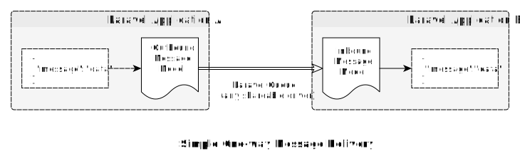
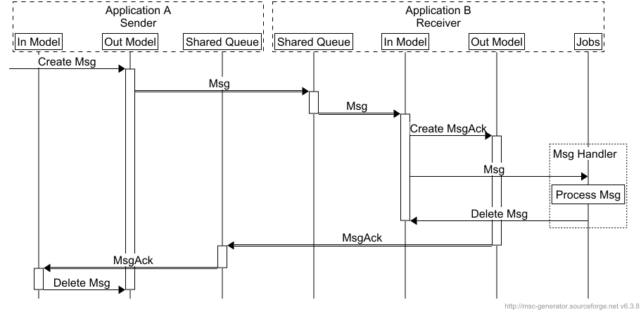

[](https://packagist.org/packages/consilience/laravel-message-flow) [](https://packagist.org/packages/consilience/laravel-message-flow) [](https://packagist.org/packages/consilience/laravel-message-flow) [](https://packagist.org/packages/consilience/laravel-message-flow)

# Laravel Message Flow

<!-- TOC -->

- [Laravel Message Flow](#laravel-message-flow)
    - [Background](#background)
    - [Messages](#messages)
    - [Reliability](#reliability)
        - [Outbound Message Status](#outbound-message-status)
    - [Flexibility](#flexibility)
        - [Outbound Routing](#outbound-routing)
    - [Configuration](#configuration)
- [Installation](#installation)
    - [Requirements](#requirements)
    - [Install Using Composer](#install-using-composer)
    - [Publish Migrations and Config](#publish-migrations-and-config)
    - [Example Configuration Using Redis](#example-configuration-using-redis)
    - [Sending an example message](#sending-an-example-message)
- [Artisan Commands](#artisan-commands)
    - [Create Message](#create-message)
    - [List Messages](#list-messages)
- [Testing](#testing)
- [TODO](#todo)

<!-- /TOC -->

## Background

This package provides a pipe between two (or more) Laravel applications,
to send messages from a model on one application to a model on the
other application. It uses Laravel queues to pass the message across.
It attempts to do this robustly, reliably and flexibly.

If you can share a single queue database between Laravel applications,
then this package will support passing messages between these applications.

You can mix as many queue connections and queues as you like to route
the messages between multiple applications.

The use-case for this package is to replace a number of webhooks between
a suite of applications. The webhooks were becoming difficult to set
up, maintain and monitor. This package aims to tackle those problems.é

## Messages

A message is any data or object that can be serialised into JSON in a
portable way. Being portable means the object can be deserialised without
reference to any models or objects in the source application.
It's just data that can stand on its own.

Every message is given a UUID that gets carried across with it,
and is given a name that can be used for routing to specific queues
when sending, or routing to specific jobs when receiving.

In its most basic implementation, this package will take a message saved
to a model on one application, and move it to a model on
another application.
It does this using laravel queues as its communication channel.



## Reliability

This package ensures the message is dispatched to a queue.
Once dispatched, responsibility is handed over to the queuing broker
and it is considered sent. There is no end-to-end confirmation of receipt,
though that can be easily achieved with a simple message
in the opposite direction.

### Outbound Message Status

This package will be observing the `MessageFlowOut` model.
When an instance status reaches the `new` status, it will be dispatched to
the queue it has been routed to. If it successfully dispatched, then its
status will move to `processed`. If it could not be dispatched to the
queue, then its status will be `failed`.

You may use additional statuses for other states in your process, and they
will be ignored.

Optionally, a `processed` outbound `MessageFlowOut` model instance can be
automatically deleted. A `failed` instance will never be deleted, so it
can be retried. The approach taken here is that once a message is safely
accepted by the queue, then it is no longer the responsilbility of the
sending model.

However, if it is important to know that the message was safely received
and processed by the receiver, then a response channel can be set up
to confirm this, simply by configuring the sender and receiver applications
to send messages in the opposite direction. Different message names would
be used to distinguish the different content and purpose of the original
message and its acknowledgement response.



## Flexibility

To send a message, the payload is created as a `MessageFlowOut` model
instance. A pipeline of actions then routes that message to the correct
queue joining the two applications, and deletes it once it is safely
in the queue.

You do, however, have full control of that pipeline, and can add or
remove actions as necessary.
For example, you can remove the `DeleteCompleteMessage` action so queued
messages stay on the sender application for longer. You can add custom
routing rules, or maybe "tee" the messages into multiple destinations
(assuming that is not something you can do in the queue broker already).
You may simply want to put in additional logging.
The flexibility is there.

### Outbound Routing

*TODO: describe how message names route to queues and connections.*

## Configuration

Here is an overview of the configuration steps:

1. On sender and receiver, create and configure a laravel queue that
   will be shared by both applications.
   An example configuration of a shared redis queue is given below,
   but any driver can be used.
2. Configure the Message Flow package to use the shared queue.
3. Create an observer to handle inbound messages on the receiver.

# Installation

## Requirements

- Laravel `8` or higher (laravel 7 is planned)
- PHP `7.4` or higher

This package is currently not registered on packagist.
Until it is, add this entry into your `composer.json` repositories block.

```json
{
    "repositories": [
        {
            "type": "vcs",
            "url": "https://github.com/consilience/laravel-message-flow"
        }
    ]
}
```

## Install Using Composer

```bash
composer require consilience/laravel-message-flow
```

## Publish Migrations and Config

```
php artisan vendor:publish \
    --provider="Consilience\Laravel\MessageFlow\MessageFlowServiceProvider"
```

You can then run `php artisan migrate` to migrate the database.

## Example Configuration Using Redis

We'll show an example of setting up the package for sender and receiver application with redis.
First, we need a queue connection that is shared between the sender and receiver applications.
We will use `redis` for te queue driver.

Laravel, by default, sets a prefix for all redis keys that is unique to the application.
This allows multiple applications to use a single redis database without keys clashing.
For our purposes, we want a prefix that *is* shared between applications.

The application-wide prefix added to redis keys is defined in `config/database.php`:

```
    'redis' => [

        'client' => env('REDIS_CLIENT', 'phpredis'),

        'options' => [
            'cluster' => env('REDIS_CLUSTER', 'redis'),

            // Remove this default global prefix option:

            'prefix' => env('REDIS_PREFIX', Str::slug(env('APP_NAME', 'laravel'), '_').'_database_'),
        ],

        // ...
    ],
```

The `default` and the `cache` database entries will then need the prefix adding
to them. This will restore the prefix to prevent them clashing with other
applications using the same redis database:

`config/database.php`:

```
    'redis' => [

        'client' => env('REDIS_CLIENT', 'phpredis'),

        'options' => [
            'cluster' => env('REDIS_CLUSTER', 'redis'),
        ],

        'default' => [
            'url' => env('REDIS_URL'),
            'host' => env('REDIS_HOST', '127.0.0.1'),
            'password' => env('REDIS_PASSWORD', null),
            'port' => env('REDIS_PORT', '6379'),
            'database' => env('REDIS_DB', '0'),

            // Prefix needed here:

            'prefix' => env('REDIS_PREFIX', Str::slug(env('APP_NAME', 'laravel'), '_').'_database_'),
        ],

        'cache' => [
            'url' => env('REDIS_URL'),
            'host' => env('REDIS_HOST', '127.0.0.1'),
            'password' => env('REDIS_PASSWORD', null),
            'port' => env('REDIS_PORT', '6379'),
            'database' => env('REDIS_CACHE_DB', '1'),
            
            // Prefix needed here:

            'prefix' => env('REDIS_PREFIX', Str::slug(env('APP_NAME', 'laravel'), '_').'_database_'),
        ],
    ],
```

Now to add the shared connection.
This provides access to the redis database that both applications will share.

`config/database.php`:

```php
    'redis' => [
        'client' => env('REDIS_CLIENT', 'phpredis'),

        // ...

        // Give this connection any name other than your application name.
        // You may need to set different credentials if the shared redis
        // database is not the default database.

        'message-flow-database' => [
            'url' => env('REDIS_URL'),
            'host' => env('REDIS_HOST', '127.0.0.1'),
            'password' => env('REDIS_PASSWORD', null),
            'port' => env('REDIS_PORT', '6379'),
            'database' => env('REDIS_CACHE_DB', '0'),
            'prefix' => 'message-flow:',
        ],
    ],
```

The shared queue connection, using redis, should now be complete.
We can configure a queue using the shared connection:

`config/queue.php`:

```php
    'connections' => [
        // ...

        'message-flow-queue-connection' => [
            'driver' => 'redis',
            'connection' => 'message-flow-database',
            'queue' => env('REDIS_QUEUE', 'default'),
            'retry_after' => 90,
            'block_for' => null,
        ],
    ],
```

Now we configure *Message Flow* to use this connection and database.

`config/message-flow.php`:

```php
    'name-mappings' => [
        'default' => [
            'queue-connection' => 'message-flow-queue-connection',
            'queue-name' => 'message-flow',
        ],
    ],
```

Both the sending and receiving applications will have the same settings.
The receiving application will listen to the queue to handle the incoming
messages:

    php artisan queue:work message-flow-queue-connection --queue=message-flow

Note: for each shared queue, just one application will be subscribed to it
and handling messages pushed onto it.
Conversely, any number of applications can push messages onto that queue.
If there are multiple applications sending messages to each other, it helps
if each shared queue is named with reference to the application subscribed
to it.

## Sending an example message

You can send a message simply by creating a new MessageFlowOut model from your sender application:

```php
use Consilience\Laravel\MessageFlow\Models\MessageFlowOut;

MessageFlowOut::create(["payload" => ["data" => "test data here"]]);

MessageFlowOut::create(["payload" => $myModel]);
```

To retrieve the message from the receiver application, a listener can be
pointed at the inbound model. Create an observer:

    php artisan make:observer MessageFlowObserver \
        --model='Consilience\Laravel\MessageFlow\Models\MessageFlowIn'

An example observer may be set up like this:

```php
<?php

namespace App\Observers;

use Consilience\Laravel\MessageFlow\Models\MessageFlowIn;

class MessageFlowObserver
{
    /**
     * Handle the MessageFlowIn "created" event.
     *
     * @param  \App\Models\Consilience\Laravel\MessageFlow\Models\MessageFlowIn  $messageFlowIn
     * @return void
     */
    public function created(MessageFlowIn $messageFlowIn)
    {
        if ($messageFlowIn->isNew()) {
            // Process the message.

            // ...

            // A number of options once processed, either here or in
            // a dispatched job:

            $messageFlowIn->setComplete()->save(); // Set it as processed
            $messageFlowIn->setFailed()->save(); // Set it as unprocessed
            $messageFlowIn->delete(); // Delete the message (not before a dispatched job is processed)
            // or a custom action or status.
        }
    }
}
```

The observer would need to be registered, for example in `App\Providers\EventServiceProvider`:

```php
<?php

namespace App\Providers;

use Illuminate\Foundation\Support\Providers\EventServiceProvider as ServiceProvider;
use Consilience\Laravel\MessageFlow\Models\MessageFlowIn;
use App\Observers\MessageFlowObserver;

class EventServiceProvider extends ServiceProvider
{
    //...

    /**
     * Register any events for your application.
     *
     * @return void
     */
    public function boot()
    {
        MessageFlowIn::observe(MessageFlowObserver::class);
    }
}
```

# Artisan Commands

This package introduces a few new artisan commands:

## Create Message

This command allows you to create a new outbound message.

    php artisan message-flow:create-message \
        --name='routing-name' \
        --payload='{"json":"payload"}' \
        --status=new

If no options are provided, the name will be `default`, the status `new` and
the payload an empty object.

## List Messages

This command will list the messages currently in the cache tables.
These are messages that are being sent, or have been sent and have
not yet been deleted. They are also messages that have been received
and also not been deleted.

    php artisan message-flow:list-messages \
        --direction={inbound|outbound} \
        --status={new|complete|failed|other} \
        --uuid={uuid-of-message} \
        --limit=20 \
        --page=1 \
        --process

The `status` and `uuid` options can take multiple values.

The `limit` option sets the number of records returned.
This is effectively the page size.

The `page` optuion specifies which page (of size `limit`) to display.
Page numbers start at 1 for the first page.

The `process` option will dispatch jobs for messages that have not yet been processed.
For outbound messages that will be matching messages in the `new` or `failed` states.
This will generally only be needed for testing or kicking off failed observers.
For inbound messages in the `new` state, this will fire the eloquent `created` event
to kick the custom observers into action.

With the `-v` option, the payload will be included in the listing.
Some payloads may be large.

# Testing

Unit tests can be run with `docker-compose` using the
[excellent instructions here](https://thephp.website/en/issue/php-docker-quick-setup/)

The tests are set up to run under PHP 7.4.
To execute the unit tests run the `phpunit` service:

    docker-compose run phpunit

Additional options can be supplied if needed.
The `composer` service provides support for composer running under the same PHP version:

    docker-compose run composer list
    docker-compose run composer update

# TODO

* Overview of the states.
* Names and routing (advanced config).
* Outbound pipeline (advanced config).
* Tests to complete.
* Support testing against multiple framwework versions (7 and 8) and PHP versions.
