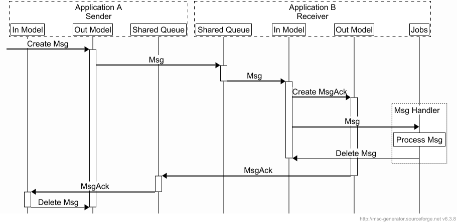

[](https://packagist.org/packages/consilience/laravel-message-flow) [](https://packagist.org/packages/consilience/laravel-message-flow) [](https://packagist.org/packages/consilience/laravel-message-flow) [](https://packagist.org/packages/consilience/laravel-message-flow)

# Laravel Message Flow

<!-- TOC -->

- [Laravel Message Flow](#laravel-message-flow)
    - [Overview](#overview)
    - [Concepts](#concepts)
        - [Messages](#messages)
        - [Outbound Flow](#outbound-flow)
        - [Inbound Flow](#inbound-flow)
        - [Routing Pipeline](#routing-pipeline)
        - [Message Statuses](#message-statuses)
    - [Configuration](#configuration)
- [Installation](#installation)
    - [Requirements](#requirements)
    - [Install Using Composer](#install-using-composer)
    - [Publish Migrations and Config](#publish-migrations-and-config)
    - [Example Configuration Using Redis](#example-configuration-using-redis)
    - [Sending an example message](#sending-an-example-message)
- [Artisan Commands](#artisan-commands)
    - [Create Message](#create-message)
    - [List Messages](#list-messages)
    - [Purge Messages](#purge-messages)
- [Testing](#testing)

<!-- /TOC -->

## Overview

Laravel Message Flow is a lightweight messaging system for passing structured
data between Laravel applications. It is built entirely on Laravel's queue
system — if two applications can connect to the same queue (Redis, database,
SQS, or any other driver), they can exchange messages.

There are no external dependencies beyond Laravel itself. No message broker
to install, no new protocols to learn — just queue connections you already
know how to configure.

The original use-case was to replace fragile webhooks between a suite of
applications with something easier to set up, monitor and maintain.


## Concepts

### Messages

A message is any JSON-serialisable data. Each message carries three things:

- A **UUID** that uniquely identifies the message across applications.
- A **name** used for routing (which queue to send to) and handling
  (which observer processes it on the receiving side).
- A **payload** — the JSON data itself, portable and self-contained with
  no dependency on models or classes in the source application.

### Outbound Flow

Sending a message is as simple as creating a `MessageFlowOut` model instance.
An Eloquent observer detects the new record and dispatches it through a
configurable **routing pipeline** that determines which queue connection and
queue name to use, then pushes the message onto that queue.

The outbound message is stored in the `message_flow_out` table throughout
this process, giving you a local audit trail of what was sent.

### Inbound Flow

On the receiving application, a standard Laravel queue worker picks up the
job and writes it to the local `message_flow_in` table as a `MessageFlowIn`
model. Your application then handles the message via an Eloquent observer —
the same pattern you already use for model events.

Once processed, the inbound message can be marked as `complete`, `failed`,
or deleted, depending on your application's needs.

### Routing Pipeline

The outbound routing pipeline is a sequence of configurable pipe stages
(using Laravel's `Pipeline`) that each message passes through before being
dispatched. The default pipeline routes the message to a queue based on its
name (via config mappings), dispatches it, and optionally cleans up the
local record.

You have full control over this pipeline. You can add custom routing logic,
logging, duplicate detection, or anything else — each stage is a simple
class implementing a `handle` method.

### Message Statuses

Both inbound and outbound messages track their lifecycle through a `status`
column:

**Outbound (`MessageFlowOut`):**

| Status     | Meaning                                         |
|------------|--------------------------------------------------|
| `new`      | Created, waiting to be routed and dispatched     |
| `queued`   | Successfully dispatched to the queue             |
| `complete` | Fully processed (dispatched, optionally acknowledged) |
| `failed`   | Could not be dispatched — can be retried         |

**Inbound (`MessageFlowIn`):**

| Status     | Meaning                                         |
|------------|--------------------------------------------------|
| `new`      | Received, waiting for the application to handle  |
| `complete` | Successfully processed by the application        |
| `failed`   | Processing failed — can be retried               |

Failed messages are never automatically deleted, so they can be inspected
and retried. Completed messages can be cleaned up with the
`message-flow:purge` artisan command or by enabling the
`DeleteCompleteMessage` pipe in the outbound routing pipeline.

Optionally, acknowledgement messages can be sent in the reverse direction
to confirm end-to-end delivery:



## Configuration

Here is an overview of the configuration steps:

1. On sender and receiver, create and configure a Laravel queue connection
   that is shared by both applications.
   An example configuration of a shared Redis queue is given below,
   but any driver can be used.
2. Configure the Message Flow package to use the shared queue.
3. Create an observer to handle inbound messages on the receiver.

# Installation

## Requirements

- PHP `8.4` or higher
- Laravel `10`, `11` or `12`

## Install Using Composer

```bash
composer require consilience/laravel-message-flow
```

## Publish Migrations and Config

```
php artisan vendor:publish \
    --provider="Consilience\Laravel\MessageFlow\MessageFlowServiceProvider"
```

You can then run `php artisan migrate` to migrate the database.

## Example Configuration Using Redis

Laravel uses the word "connection" at several levels, which can be
confusing. This example touches three config files, each at a different
layer:

| Layer            | Config file               | What it names                                                          |
| ---------------- | ------------------------- | ---------------------------------------------------------------------- |
| **Redis server** | `config/database.php`     | How to reach a Redis instance and which key prefix to use              |
| **Queue**        | `config/queue.php`        | A named queue that uses a particular Redis server entry as its backend |
| **Message Flow** | `config/message-flow.php` | Which named queue to push messages onto                                |

No changes to your existing Laravel defaults are needed — we just add
new entries alongside them.

**Step 1 — Redis server** (`config/database.php`)

Add a shared Redis entry with a fixed `prefix` so that every application
using it sees the same keys, regardless of each app's global prefix:

```php
'redis' => [
    // Your existing options and entries stay unchanged.

    // Shared Redis entry for message flow:
    'message-flow-redis' => [
        'url' => env('REDIS_URL'),
        'host' => env('REDIS_HOST', '127.0.0.1'),
        'password' => env('REDIS_PASSWORD', null),
        'port' => env('REDIS_PORT', '6379'),
        'database' => env('REDIS_DB', '0'),
        'prefix' => 'message-flow:',
    ],
],
```

**Step 2 — Queue** (`config/queue.php`)

Add a named queue that uses the Redis entry from Step 1 as its backend:

```php
'connections' => [
    // ...

    'message-flow-queue' => [
        'driver' => 'redis',
        'connection' => 'message-flow-redis', // ← Redis entry from Step 1
        'queue' => 'message-flow',
        'retry_after' => 90,
        'block_for' => null,
    ],
],
```

**Step 3 — Message Flow** (`config/message-flow.php`)

Tell Message Flow which named queue to push messages onto:

```php
'name-mappings' => [
    'default' => [
        'queue-connection' => 'message-flow-queue', // ← queue from Step 2
        'queue-name' => 'message-flow',
    ],
],
```

Both the sending and receiving applications need the same configuration
from steps 1–3.

The receiving application listens to the shared queue:

```bash
php artisan queue:work message-flow-queue --queue=message-flow
```

For each shared queue, one application subscribes and handles messages.
Any number of applications can push messages onto that queue. If multiple
applications send messages to each other, name each queue after the
receiving application for clarity.

## Sending an example message

You can send a message simply by creating a new MessageFlowOut model from your sender application:

```php
use Consilience\Laravel\MessageFlow\Models\MessageFlowOut;

MessageFlowOut::create(["payload" => ["data" => "test data here"]]);

MessageFlowOut::create(["payload" => $myModel]);
```

To retrieve the message from the receiver application, a listener can be
pointed at the inbound model. Create an observer:

    php artisan make:observer MessageFlowObserver \
        --model='Consilience\Laravel\MessageFlow\Models\MessageFlowIn'

An example observer may be set up like this:

```php
<?php

namespace App\Observers;

use Consilience\Laravel\MessageFlow\Models\MessageFlowIn;

class MessageFlowObserver
{
    /**
     * Handle the MessageFlowIn "created" event.
     *
     * @param  \Consilience\Laravel\MessageFlow\Models\MessageFlowIn $messageFlowIn
     * @return void
     */
    public function created(MessageFlowIn $messageFlowIn)
    {
        if ($messageFlowIn->isNew()) {
            // Process the message.

            // ...

            // A number of options once processed, either here or in
            // a dispatched job:

            $messageFlowIn->setComplete()->save(); // Set it as processed
            $messageFlowIn->setFailed()->save(); // Set it as unprocessed
            $messageFlowIn->delete(); // Delete the message (not before a dispatched job is processed)
            // or a custom action or status.
        }
    }
}
```

The observer would need to be registered, for example in `App\Providers\EventServiceProvider`:

```php
<?php

namespace App\Providers;

use Illuminate\Foundation\Support\Providers\EventServiceProvider as ServiceProvider;
use Consilience\Laravel\MessageFlow\Models\MessageFlowIn;
use App\Observers\MessageFlowObserver;

class EventServiceProvider extends ServiceProvider
{
    //...

    /**
     * Register any events for your application.
     *
     * @return void
     */
    public function boot()
    {
        MessageFlowIn::observe(MessageFlowObserver::class);
    }
}
```

# Artisan Commands

This package introduces a few new artisan commands:

## Create Message

This command allows you to create a new outbound message.

    php artisan message-flow:create-message \
        --name='routing-name' \
        --payload='{"json":"payload"}' \
        --status=new

If no options are provided, the name will be `default`, the status `new` and
the payload an empty object.

## List Messages

This command will list the messages currently in the cache tables.
These are messages that are being sent, or have been sent and have
not yet been deleted. They are also messages that have been received
and also not been deleted.

    php artisan message-flow:list-messages \
        --direction={inbound|outbound} \
        --status={new|complete|failed|other} \
        --uuid={uuid-of-message} \
        --limit=20 \
        --page=1 \
        --process

The `status` and `uuid` options can take multiple values.

The `limit` option sets the number of records returned.
This is effectively the page size.

The `page` optuion specifies which page (of size `limit`) to display.
Page numbers start at 1 for the first page.

The `process` option will dispatch jobs for messages that have not yet been processed.
For outbound messages that will be matching messages in the `new` or `failed` states.
This will generally only be needed for testing or kicking off failed observers.
For inbound messages in the `new` state, this will fire the eloquent `created` event
to kick the custom observers into action.

With the `-v` option, the payload will be included in the listing.
Some payloads may be large.

## Purge Messages

This command deletes old messages from the inbound and/or outbound cache tables.
By default it purges records with a `complete` status that were last updated
more than 30 days ago.

    php artisan message-flow:purge \
        --days=30 \
        --hours=0 \
        --direction={inbound|outbound|both} \
        --status={complete|failed} \
        --dry-run

The `--days` and `--hours` options are combined to set the age threshold.
For example, `--days=1 --hours=12` purges records older than 36 hours,
and `--days=0 --hours=6` purges records older than 6 hours.

The `--direction` option defaults to `both`. Abbreviations are accepted
(e.g. `--direction=in` or `--direction=out`).

The `--status` option can be specified multiple times to purge records
in more than one status. It defaults to `complete` if not specified.

The `--dry-run` option shows how many records would be deleted without
actually deleting them.

### Running manually

Purge all completed messages older than 30 days from both tables:

    php artisan message-flow:purge

Purge completed and failed inbound messages older than 7 days:

    php artisan message-flow:purge --days=7 --direction=inbound --status=complete --status=failed

Preview what would be deleted:

    php artisan message-flow:purge --days=14 --dry-run

### Scheduling

To run the purge automatically, add it to your application's scheduler.

In `routes/console.php` (Laravel 11+):

```php
use Illuminate\Support\Facades\Schedule;

Schedule::command('message-flow:purge --days=30')->daily();
```

Or in a service provider's `boot()` method:

```php
$this->app->booted(function () {
    $schedule = app(\Illuminate\Console\Scheduling\Schedule::class);
    $schedule->command('message-flow:purge --days=30')->daily();
});
```

# Testing

Tests use [Orchestra Testbench](https://github.com/orchestral/testbench) and PHPUnit:

```bash
composer test
```

# TODO

* Names and routing (advanced config).
* Outbound pipeline (advanced config).
* Tests to complete.
